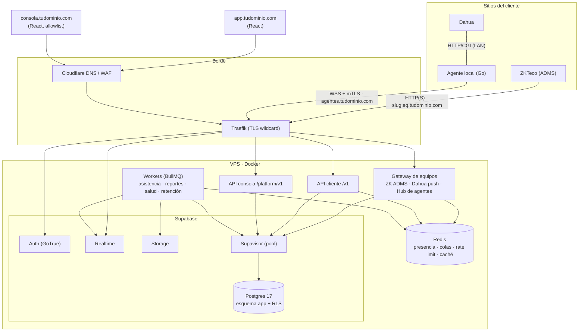

# 01 · Plataforma e infraestructura

## 1. ¿Supabase o no? Veredicto

**Sí a Supabase, pero como plataforma de Postgres + Auth + Realtime + Storage, no como backend.** Los relojes y las reglas de negocio viven en servicios propios.

Por qué sí:

- Es **Postgres de verdad**: RLS, particionado, `pg_cron`, funciones. Todo el modelo de permisos ([02](02-tenancy-roles-permisos.md)) es SQL estándar.
- **Auth listo para producción**: MFA TOTP, recuperación de clave, rate limit de login, refresh tokens rotativos y el hook para inyectar el contexto de empresa. Hacerlo bien a mano cuesta semanas.
- **Realtime con autorización** (canales privados) para el estado de equipos y las marcaciones en vivo. **Storage** con URLs firmadas para exportaciones.
- **Salida barata.** Son Postgres + GoTrue. Pasar de self-hosted a Supabase Cloud, o a Postgres gestionado con otra capa de auth, es `pg_dump` + configuración. No hay dependencia fuerte.

Lo que Supabase **no** debe hacer en este sistema:

| No usar | Por qué | En su lugar |
|---|---|---|
| Edge Functions para hablar con los relojes | ADMS es sondeo HTTP cada 10–30 s × miles de equipos, texto plano, rutas fijas `/iclock/*`. Dahua usa conexiones largas desde el agente. Arranques en frío, costo y límites de ejecución no encajan. | **Gateway propio** (Node) siempre encendido |
| PostgREST expuesto al navegador sobre las tablas | Las reglas de negocio (encolar comandos, cifrar tarjetas, sagas, DTO por audiencia, cuotas con mensajes útiles) quedarían repartidas entre el front y políticas. Además amplía la superficie de ataque. | **API propia** (`/v1`) que entra a Postgres como `authenticated` con RLS |
| Realtime `postgres_changes` sobre `marcaciones` | Evalúa RLS por cada suscriptor en cada fila insertada; la propia Supabase advierte que no escala con tablas de alta escritura | **Broadcast** desde el backend a canales privados `tenant:{id}:…` |
| Storage para plantillas o fotos biométricas | Decisión de producto: no se almacena biometría ([03](03-dispositivos-zkteco-dahua.md)) | Solo indicadores en BD |
| Tablas en el esquema `public` | Expuesto por PostgREST y con privilegios por defecto a `anon`/`authenticated` | Esquema `app` |

**Alternativa evaluada:** Postgres puro + auth propia (Keycloak, Zitadel o Better Auth). Da más control a cambio de más trabajo y más piezas que operar. Hoy no compensa. Reconsidéralo solo si un cliente corporativo exige SSO SAML con requisitos que GoTrue no cubra. Supabase Auth soporta SAML, pero conviene validarlo contra el caso concreto.

## 2. Supabase self-hosted en tu VPS: condiciones

Es razonable para empezar si respetas esto:

1. **Postgres dedicado a este SaaS.** No lo compartas con tus otros proyectos del VPS: un reporte pesado de otro proyecto no puede tumbar la recepción de marcaciones. Pon límites de CPU y RAM a cada contenedor.
2. **Backups y PITR corren por tu cuenta.** Self-hosted no los trae. Usa **WAL-G** (o pgBackRest) hacia almacenamiento S3 externo (Backblaze B2, Cloudflare R2, Wasabi), con base diaria y WAL continuo. **Prueba una restauración cada mes.** Un backup no probado no es un backup.
3. **Desactiva lo que no uses.** El stack trae unos 12 contenedores (db, auth, rest, realtime, storage, imgproxy, meta, studio, kong, functions, analytics, vector, supavisor). Aquí sobran `functions` e `imgproxy`, y `analytics`/`vector` si ya tienes Loki. Menos RAM, menos superficie.
4. **Studio nunca expuesto a internet.** Solo por túnel SSH o VPN (WireGuard/Tailscale).
5. **Versiones fijadas y staging.** Nada de `latest`. Actualiza primero en un entorno de prueba (otro compose en el mismo VPS sirve).
6. **Disco con margen.** Alerta al 70 %. Las marcaciones crecen de forma predecible (ver §5).

**Cuándo salir del VPS único** (cualquiera de estas señales):

- CPU de Postgres sostenida > 60 % o disco > 70 % con la retención ya aplicada.
- Más de ~2.000 equipos o ~1 M de marcaciones/día.
- Un cliente exige SLA ≥ 99,9 % o recuperación ante desastre documentada.

**El siguiente paso:** Postgres a un servidor dedicado o a **Supabase Cloud (Team/Enterprise)**, con PITR y réplica de lectura. El gateway y la API pasan a 2+ nodos detrás de un balanceador. El código no cambia porque todo es stateless salvo Postgres y Redis.

## 3. Componentes



| Componente | Responsabilidad | Escala |
|---|---|---|
| **Gateway de equipos** | Habla cada protocolo (ZK ADMS; Dahua push; hub WSS de agentes). Autentica equipos, normaliza eventos a un modelo canónico, entrega comandos. | Stateless, horizontal |
| **API cliente** | Único punto de entrada del panel del cliente y de las integraciones (API keys). Valida, aplica guards, encola comandos, dispara jobs. | Stateless, horizontal |
| **API consola** | Superficie de plataforma. Despliegue aparte, dominio aparte, allowlist de IP/VPN, MFA obligatorio. | 1 instancia basta |
| **Workers** | Cálculo de asistencia, reportes, detección de equipos caídos, reintentos y expiración de comandos, particiones, retención, webhooks. | Por cola |
| **Redis** | Presencia de equipos, bandera "hay comandos", rate limit, caché de permisos, colas BullMQ. | Un nodo con AOF; luego Sentinel o gestionado |
| **Postgres (Supabase)** | Fuente de verdad. RLS. Particiones. | Vertical, luego réplica de lectura |
| **Agente local** | En la sucursal: equipos que no llegan solos a la nube (Dahua por CGI, ZK sin ADMS). Buffer offline. | Uno por sitio |

## 4. Stack

| Capa | Elección | Por qué |
|---|---|---|
| Lenguaje backend | **TypeScript** (Node 22 LTS) | Continuidad con lo que ya tienes. Tipos compartidos entre API, gateway, workers y frontend. |
| HTTP | **Fastify** | Rendimiento, esquemas y hooks por ruta. Express 5 (actual) también sirve; Fastify escala mejor en el gateway. |
| Acceso a datos | **Kysely** + migraciones **SQL** (Supabase CLI) | El SQL es el contrato (RLS, triggers). Kysely da tipos sin esconder el SQL, que es tu estilo actual. |
| Validación / contrato | **Zod** → OpenAPI | Un esquema valida la entrada y genera la documentación. |
| Jobs | **BullMQ** (Redis) | Reintentos, prioridades, deduplicación, jobs programados. |
| Frontend | **React + Vite + TS**, TanStack Router/Query, shadcn/ui | SPA detrás de login: no necesita SSR. Dos apps (cliente y consola) con UI compartida. |
| Agente local | **Go** | Binario único y pequeño, servicio de Windows o systemd, poca RAM, auto-actualizable. Es lo que se instala en miles de sitios. |
| Proxy | **Traefik** | Labels de Docker (convive con tus otros proyectos) y certificado wildcard por DNS-01 con Cloudflare. |
| Observabilidad | pino → **Loki**, **Prometheus + Grafana**, **Sentry** (o GlitchTip self-hosted), Uptime Kuma | Logs estructurados con `request_id`, métricas de negocio (equipos en línea, lag de ingesta, cola) y alertas. |
| Backups | **WAL-G** → S3 compatible | PITR real. |

**Monorepo** (pnpm + Turborepo):

```
senseface/
  apps/
    web/          # panel del cliente  (app.tudominio.com)
    consola/      # plataforma         (consola.tudominio.com)
    api/          # /v1                (api.tudominio.com)
    api-consola/  # /platform/v1       (consola-api.tudominio.com)
    gateway/      # /iclock, /dahua, hub de agentes (*.eq.tudominio.com, agentes.tudominio.com)
    worker/
    agente/       # Go
  packages/
    dominio/      # tipos canónicos: EventoMarcacion, AccionDispositivo, catálogo de permisos
    adaptadores/  # zkteco/, dahua/  (renderizar comandos, parsear eventos)
    db/           # kysely, comoUsuario(), tipos generados
    authz/        # guards, caché de permisos
    ui/
  supabase/
    migrations/   # 001…, 002…, 003… (los de docs/arquitectura/sql, versionados)
    tests/        # pruebas SQL (010_pruebas_permisos.sql) en CI
  infra/
    compose/      # docker-compose por entorno
    traefik/  grafana/  walg/
```

## 5. Capacidad

Supuestos: 1 equipo ≈ 60 personas × 5 eventos/día = 300 eventos/día. Latido ADMS cada 10 s (`Delay=10`, como hoy). Una marcación ≈ 350 bytes con índices.

| Escenario | Equipos | Latidos/s | Marcaciones/día | Crecimiento BD/año | Infra |
|---|---|---|---|---|---|
| Inicio | 200 | 20 | 60 mil | ~8 GB | VPS 4–8 vCPU / 16 GB |
| Medio | 2.000 | 200 | 600 mil | ~75 GB | VPS dedicado 8 vCPU / 32 GB, o Postgres aparte |
| Grande | 10.000 | 1.000 | 3 M | ~380 GB | Postgres dedicado + réplica; 3+ nodos de gateway |

**La carga real está en los latidos, no en las marcaciones.** Hoy cada `GET /iclock/getrequest` hace dos escrituras en Postgres ([server.js:243](../../server.js#L243) y [server.js:479](../../server.js#L479)). Con 2.000 equipos serían ~400 escrituras/s solo para decir "sigo vivo", y eso genera WAL e hinchazón de tablas. El diseño:

1. **Presencia en Redis** (`SET presencia:{equipo} ts EX 120`). Un worker vuelca `ultimo_contacto` a Postgres **por lotes cada 60 s** y detecta los cambios en línea ↔ fuera de línea.
2. **Bandera de comandos pendientes en Redis.** Al encolar se marca `pend:{equipo}`. El 99 % de los latidos se responde `OK` sin tocar Postgres. Solo si hay bandera se consulta la cola (`FOR UPDATE SKIP LOCKED`). Cada 60 s se consulta igual, para autocorregirse si Redis se reinició.
3. **Ingesta por lotes e idempotente**: `INSERT … SELECT FROM unnest(…) ON CONFLICT DO NOTHING`, con el empleado resuelto desde una caché `(tenant, pin) → empleado_id`.
4. **Picos de entrada (08:00)**: con 10.000 equipos pueden llegar decenas de miles de marcaciones en minutos. Si la latencia de ingesta sube, el gateway escribe primero en un **Redis Stream** y un worker las pasa a Postgres en lotes. El equipo recibe `OK` en cuanto el evento es durable. Es una optimización para el escenario grande, no para el día 1.

## 6. Despliegue en el VPS

Hostnames:

| Host | Servicio | Exposición |
|---|---|---|
| `app.tudominio.com` | Panel del cliente | Público (Cloudflare proxy) |
| `api.tudominio.com` | API `/v1` | Público (Cloudflare proxy) |
| `auth.tudominio.com` | Supabase Kong → Auth / Realtime / Storage | Público (solo esas rutas; bloquear `/rest/v1` y `/pg`) |
| `consola.tudominio.com`, `consola-api.tudominio.com` | Plataforma | **Allowlist de IP o Cloudflare Access / VPN** |
| `*.eq.tudominio.com` | Gateway ZKTeco ADMS | Público. Puerto 80 y 443 si el firmware soporta HTTPS. Sin proxy de Cloudflare si el equipo no tolera sus cabeceras o puertos. |
| `agentes.tudominio.com` | Hub WSS de agentes (mTLS) | Público, DNS-only (el mTLS termina en Traefik) |

Reglas del compose:

- Una red interna `senseface_int` para Postgres, Redis, workers y Kong. Solo Traefik se publica en el host.
- `deploy.resources.limits` en cada servicio. Postgres con `shared_buffers` ≈ 25 % de su límite de RAM.
- Secretos por `docker secret` o archivo `.env` fuera del repo, con permisos 600: clave maestra de cifrado, JWT secret, credenciales S3. Nada de `.secret` junto al código como hoy.
- `restart: unless-stopped` y healthchecks. Uptime Kuma vigila desde fuera del VPS.
- Firewall del host: solo 22 (con llave, sin contraseña), 80 y 443. Postgres nunca expuesto.

## 7. Ruta de escala (sin reescribir)

| Etapa | Cambio |
|---|---|
| 1 | Todo en el VPS, Postgres dedicado, WAL-G, presencia en Redis |
| 2 | Postgres a servidor propio o Supabase Cloud con PITR. Gateway y API ×2 detrás de Traefik o balanceador. |
| 3 | Réplica de lectura para reportes. Redis Stream para ingesta. Archivo de particiones viejas a Parquet en S3. |
| 4 | Gateways por región si hay clientes en varios países (latencia de los equipos). Analítica pesada en ClickHouse, alimentada desde las particiones. |
