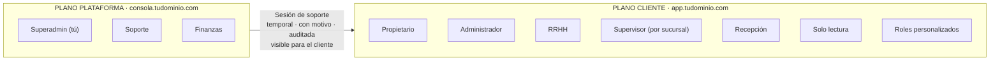
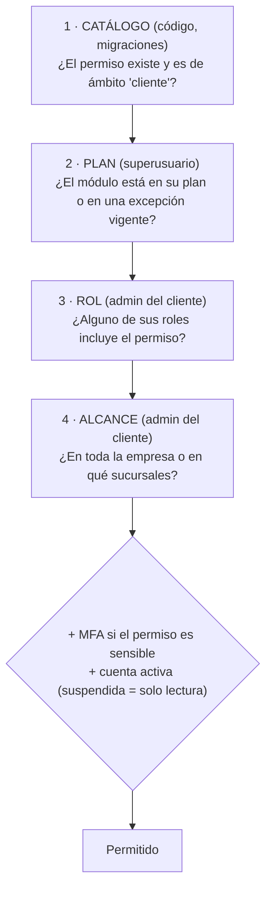
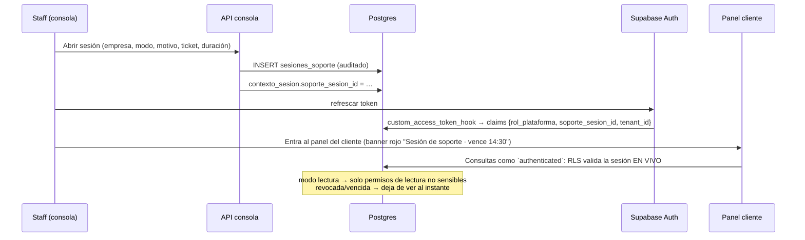

# 02 · Multi-tenancy, roles y permisos

> Responde a: *"separar el usuario administrador del super usuario (desarrollador) para gestionar qué debe y qué no debe ver el cliente"*.
> Implementación de referencia **probada**: [sql/001_nucleo_permisos.sql](sql/001_nucleo_permisos.sql), [sql/002_operacion.sql](sql/002_operacion.sql), [sql/003_catalogo.sql](sql/003_catalogo.sql) y [sql/pruebas/010_pruebas_permisos.sql](sql/pruebas/010_pruebas_permisos.sql) (65 verificaciones).

## 1. Qué pasa hoy

En [server.js](../../server.js) existen dos roles: `admin` y `empresa`.

- `admin` es a la vez **tú** (desarrollador/dueño de la plataforma) y el **administrador del cliente**. Cualquier `admin` creado desde el panel ve todas las empresas.
- `empresa` es un único rol por cliente: no hay RRHH, supervisor de sucursal ni solo lectura.
- El aislamiento entre empresas depende de que cada endpoint recuerde llamar a `checkEmpresa()`. Un olvido basta para una fuga.
- Lo técnico (comandos crudos, IP, firmware, aviso de "servidor desactualizado", equipos sin asignar) se decide en el frontend según el rol. La API no distingue audiencias.

## 2. El modelo: dos planos que no se mezclan



| | Plataforma (staff) | Cliente (tenant) |
|---|---|---|
| Tabla | `app.staff_plataforma` | `app.membresias` + `app.asignaciones_rol` |
| Roles | `superadmin`, `soporte`, `finanzas` (fijos) | 6 plantillas + roles personalizados |
| Permisos | ámbito `plataforma` | ámbito `cliente` |
| Frontend | `consola.tudominio.com` (app aparte) | `app.tudominio.com` |
| API | `/platform/v1` (despliegue aparte) | `/v1` |
| Rol de base de datos | `consola` | `authenticated` |
| MFA | Obligatorio siempre (`aal2`) | Opcional; obligatorio para permisos sensibles o si la empresa lo exige |

**Reglas duras** (las impone la base de datos, no solo la API):

1. **Cuentas separadas.** Una cuenta de staff no puede ser miembro de una empresa, y viceversa (trigger `cuentas_separadas`). Tu cuenta de superusuario nunca es "el admin de un cliente".
2. **El staff no ve datos personales de los clientes por defecto.** El rol `consola` no tiene permiso sobre `empleados` ni `marcaciones`. Para verlos hay que abrir una **sesión de soporte**: temporal (máx. 8 h), con motivo, de lectura o escritura, auditada y visible en la auditoría del cliente. Vence o se revoca y el acceso se corta en la siguiente consulta, aunque el token siga vivo.
3. **Los permisos de plataforma nunca se asignan a un cliente.** Ni desde el panel, ni por un bug de la API, ni por una migración (trigger `guardia` en `rol_permisos`).
4. **Lo técnico ni siquiera es seleccionable por el cliente.** Se aplican permisos de columna: `select firmware from app.dispositivos` como cliente devuelve *permission denied*.

## 3. Cómo se decide lo que ve y hace el cliente

El permiso efectivo es una **intersección de cuatro capas**, cada una con su dueño:



| Capa | Quién la controla | Dónde vive | Ejemplo |
|---|---|---|---|
| Catálogo | Tú, en código | `app.modulos`, `app.permisos` (migración) | `dispositivos.comando_crudo` es de plataforma y nunca lo verá un cliente |
| Plan | Superusuario / finanzas | `app.planes`, `plan_modulos`, `plan_limites`, `tenant_modulos`, `tenant_limites` | Plan Básico sin "control de acceso"; demo de 30 días activada a mano |
| Rol | Admin del cliente | `app.roles`, `app.rol_permisos` | Rol "Operador de relojes" con `dispositivos.ver` + `dispositivos.operar` |
| Alcance | Admin del cliente | `app.asignaciones_rol.sucursal_id` | Supervisor solo de "Sucursal Norte" |

Consecuencias:

- **Bajar de plan no rompe nada.** Los roles conservan sus permisos, que quedan *inertes*. Si vuelve a subir, reviven. No hay que reconfigurar.
- **Excepciones con motivo y vencimiento.** "Activar control de acceso a Empresa X hasta el 31/10 por demo" es una fila en `tenant_modulos` con `motivo` y `vence`. Queda auditada.
- **Las cuotas se aplican en la base de datos.** Un trigger serializa las altas por empresa. Solo se valida cuando una fila *pasa a contar*: retirar un equipo estando en el límite nunca se bloquea.

## 4. Qué ve el cliente y qué no

| Área | Cliente (según su rol) | Solo plataforma |
|---|---|---|
| **Equipos** | Nombre, SN, modelo, sucursal, en línea / última conexión, estado de sincronización. Acciones: aceptar equipo detectado, sincronizar, leer usuarios, recuperar marcaciones, poner en hora, abrir puerta (si el plan incluye acceso). | IP pública, firmware, info técnica, transporte, agente. Cuarentena global. Asignar o mover equipos entre empresas. Reiniciar, configurar ADMS, actualizar firmware, borrar datos del equipo, comando crudo. Logs de protocolo. |
| **Comandos** | Historial legible: "Enviar a Ana Pérez · OK", "Leer usuarios · Error: equipo fuera de línea". | Texto del protocolo (`DATA UPDATE USERINFO…`, redactado), códigos de retorno, reintentos forzados, cola global. |
| **Empleados** | Datos, sucursal, estado por equipo, tarjeta enmascarada (`****1234`), "tiene clave: sí/no". | **Nada** sin sesión de soporte. Nunca en claro: tarjeta ni clave (ni siquiera el staff). |
| **Biometría** | Indicadores: tiene rostro, n.º de huellas, por equipo. | Igual (no se almacenan plantillas: ver [03](03-dispositivos-zkteco-dahua.md)). |
| **Plan** | Módulos activos, uso vs. límites ("8 de 10 equipos"), vencimiento de excepciones. | Cambiar plan, excepciones, precios, facturación. |
| **Auditoría** | La de su empresa, **incluidas las sesiones de soporte** (quién, cuándo, por qué). | Auditoría de toda la plataforma. |
| **Sistema** | Nada. | Salud, colas, latencia de ingesta, versiones, alertas, "servidor desactualizado". |

## 5. Catálogo

**Módulos:** `nucleo` (siempre), `asistencia`, `acceso`, `reportes_avanzados`, `integraciones`. La marca (ZKTeco/Dahua) **no** es un módulo: el producto es agnóstico de la marca.

**Permisos de cliente** (28), con tipo `lectura`/`escritura`. Los *sensibles* exigen MFA y quedan fuera de las sesiones de soporte.

| Módulo | Permisos |
|---|---|
| nucleo | `cuenta.administrar`★ · `sucursales.ver/administrar` · `dispositivos.ver/administrar/operar/bandeja` · `empleados.ver/editar/eliminar` · `empleados.credenciales`★ · `marcaciones.ver/exportar` · `usuarios.ver` · `usuarios.administrar`★ · `roles.administrar`★ · `auditoria.ver` |
| asistencia | `asistencia.ver/horarios/ajustar/aprobar` |
| acceso | `acceso.eventos.ver` · `acceso.reglas` · `acceso.puertas.abrir`★ |
| reportes_avanzados | `reportes.avanzados` · `reportes.programados` |
| integraciones | `integraciones.api_keys`★ · `integraciones.webhooks` |

★ sensible

**Permisos de plataforma** (12): `plataforma.tenants.ver/administrar`, `plataforma.planes.administrar`, `plataforma.facturacion.ver`, `plataforma.dispositivos.ver/asignar/mantenimiento/comando_crudo`, `plataforma.soporte.sesion/escritura`, `plataforma.auditoria.ver`, `plataforma.staff.administrar`.

**Planes de ejemplo** (los valores son tuyos):

| | Básico | Profesional | Empresarial |
|---|---|---|---|
| Módulos | núcleo, asistencia | + acceso, reportes avanzados | + integraciones |
| Sucursales / equipos / empleados / usuarios | 2 / 3 / 100 / 3 | 10 / 25 / 1.000 / 15 | sin límite |
| Retención de marcaciones | 12 meses | 24 meses | 60 meses |

**Acciones de equipo:** cada acción canónica exige un permiso (`app.acciones_dispositivo`). `puerta.abrir` exige `acceso.puertas.abrir` y caduca a los 15 s. `comando.crudo` exige un permiso de plataforma, así que el cliente no puede encolarla aunque manipule la API.

## 6. Roles del cliente

| Plantilla | Para qué | Alcance típico |
|---|---|---|
| Propietario | Todo lo del plan, más la cuenta (MFA, transferir propiedad) | Empresa |
| Administrador | Todo lo del plan excepto la cuenta | Empresa |
| Recursos humanos | Empleados, credenciales, marcaciones, asistencia, reportes | Empresa |
| Supervisor de sucursal | Ver empleados, marcaciones y asistencia; ajustar y aprobar | **Sucursal** |
| Recepción / seguridad | Eventos de acceso en vivo, abrir puertas | Sucursal |
| Solo lectura | Todos los permisos de lectura | Empresa o sucursal |

El cliente crea **roles personalizados** eligiendo permisos del catálogo, pero solo ve los de su plan. Un usuario puede tener varios roles en distintos alcances (p. ej. "RRHH en toda la empresa" + "Recepción en Sucursal Norte"). El permiso efectivo es la **unión** de sus asignaciones.

**Reglas anti-escalada**, todas en triggers y probadas:

| Regla | Qué impide |
|---|---|
| No se otorga lo que no se tiene | Un admin no puede crear un rol con `cuenta.administrar` ni asignar el rol Propietario |
| No se cambian los propios roles | Nadie se auto-asciende ni se quita el acceso por error |
| Siempre queda un propietario activo | No se puede suspender, borrar ni degradar al último propietario |
| Las plantillas del sistema no se editan | Un cliente no "mejora" el rol Administrador para todos |
| Permisos de módulos fuera del plan son inertes | Tampoco cuentan como escalada: el propietario de un plan Básico puede nombrar a otro propietario |

## 7. Staff de plataforma y sesiones de soporte

| Rol staff | Puede |
|---|---|
| `superadmin` (tú) | Todo lo de plataforma |
| `soporte` | Ver empresas, datos técnicos de equipos, asignar equipos, mantenimiento, abrir sesiones de soporte (lectura y escritura). **Sin** comando crudo ni planes. |
| `finanzas` | Ver empresas, planes y excepciones, facturación. Sin técnica ni soporte. |

**Flujo de una sesión de soporte:**



Recomendado además: el cliente puede desactivar el soporte con escritura o exigir aprobación previa (un campo más en `tenants`). Si decides incluirlo, se ofrece como cláusula de contrato.

## 8. Dónde se aplica: tres capas

| Capa | Qué hace | Si falla… |
|---|---|---|
| **UI** | Arma menús y botones con `GET /v1/me` → `app.mis_permisos()` | Solo estética: la API y la BD bloquean igual |
| **API** | Guard por endpoint, DTO por audiencia (cliente ≠ consola), mensajes de error amables, rate limit | RLS y los permisos de columna lo contienen |
| **Base de datos** | RLS por empresa y sucursal, permisos de columna, triggers anti-escalada, FKs compuestas `(tenant_id, id)`, cuotas | Es la última línea: no depende de que el código recuerde nada |

La API **no** usa un rol con `BYPASSRLS` para atender personas. Cada petición abre una transacción, fija los claims del JWT y baja al rol `authenticated`:

```ts
// packages/db/src/contexto.ts
export async function comoUsuario<T>(claims: Claims, fn: (tx: Transaction<DB>) => Promise<T>): Promise<T> {
  return db.transaction().execute(async (tx) => {
    await sql`select set_config('request.jwt.claims', ${JSON.stringify(claims)}, true),
                     set_config('app.request_id', ${claims.request_id}, true),
                     set_config('app.ip', ${claims.ip}, true)`.execute(tx);
    await sql`set local role authenticated`.execute(tx);
    return fn(tx);
  });
}

// apps/api/src/rutas/empleados.ts
app.post('/v1/empleados', { preHandler: requiere('empleados.editar') }, async (req) =>
  comoUsuario(req.claims, (tx) => empleados.crear(tx, req.body)));  // RLS vuelve a verificarlo
```

`set_config(..., true)` y `set local` duran solo la transacción. Son compatibles con el pooling en modo transacción de Supavisor/PgBouncer.

**Roles de base de datos:**

| Rol | Lo usa | Acceso |
|---|---|---|
| `authenticated` | API del cliente (personas y sesiones de soporte) | RLS + permisos de columna |
| `consola` | API de la consola (staff) | RLS por permiso de plataforma; sin tablas de datos personales |
| `gateway` | Gateway de equipos | Permisos acotados (insertar marcaciones, actualizar comandos…), sin `BYPASSRLS` |
| `worker` | Jobs (asistencia, retención, particiones) | Por job; los que purgan datos, con rol propio |
| `postgres` | Solo migraciones | Nunca desde una aplicación |

## 9. Token y contexto

- **Supabase Auth** emite el JWT. El hook `app.custom_access_token_hook` agrega `tenant_id` y `membresia_id` (clientes) o `rol_plataforma` y `soporte_sesion_id` (staff). Se configura con `GOTRUE_HOOK_CUSTOM_ACCESS_TOKEN_ENABLED=true` y `GOTRUE_HOOK_CUSTOM_ACCESS_TOKEN_URI=pg-functions://postgres/app/custom_access_token_hook`.
- **Los claims son una pista, no la verdad.** `app.tenant_actual()` revalida en cada consulta la membresía, el estado de la empresa y la sesión de soporte. Suspender a alguien surte efecto en la siguiente consulta, no cuando vence su token.
- **Vida del token: 15 min** (`GOTRUE_JWT_EXP=900`) con refresh tokens rotativos.
- **Cambiar de empresa** (un usuario con acceso a dos): `POST /v1/sesion/empresa` actualiza `contexto_sesion` y el cliente refresca el token.
- **No metas la lista de permisos en el JWT.** Crece, envejece y obliga a re-emitir tokens. La API la cachea en Redis por `membresia_id` y la invalida cuando cambian roles o el plan.

## 10. Planes y cuotas en la práctica

| Situación | Comportamiento |
|---|---|
| Alta que supera el límite | Trigger → `P0001 "Límite del plan alcanzado: dispositivos (máximo 3)"` con `hint = plan_limite`. La API lo traduce a 402/409 con CTA "Mejorar plan". |
| Baja de plan con uso por encima | No se borra nada. Se bloquean nuevas altas y se muestra un aviso. Opcional: gracia de 15 días. |
| Módulo quitado | Menús ocultos, permisos inertes, datos conservados. Las integraciones (webhooks) se pausan. |
| Cuenta `suspendida` (impago) | Solo lectura y exportación. Los equipos siguen marcando (no se pierden datos del cliente). |
| Cuenta `cancelada` | Sin acceso. Purga programada tras el plazo contractual, con exportación previa. |
| Retención (`retencion_meses`) | Un job mensual archiva y quita las particiones fuera de plazo (ver [04](04-datos-asistencia-reportes.md)). |

## 11. Cómo correr las pruebas

Requisito: PostgreSQL 15+ vacío (no uses tu base real). En Windows, con PostgreSQL 17 instalado:

```powershell
$pg = "C:\Program Files\PostgreSQL\17\bin"
& "$pg\initdb.exe" -D "$env:TEMP\pgprueba" -U postgres -A trust -E UTF8
& "$pg\pg_ctl.exe" -D "$env:TEMP\pgprueba" -o "-p 55432" -w start
& "$pg\createdb.exe" -h localhost -p 55432 -U postgres pruebas
foreach ($f in "pruebas\000_stub_supabase.sql","001_nucleo_permisos.sql","002_operacion.sql","003_catalogo.sql","pruebas\010_pruebas_permisos.sql") {
  & "$pg\psql.exe" -h localhost -p 55432 -U postgres -d pruebas -q -v ON_ERROR_STOP=1 -f "docs\arquitectura\sql\$f"
}
& "$pg\pg_ctl.exe" -D "$env:TEMP\pgprueba" stop
```

Debe terminar en `== TODAS LAS PRUEBAS PASARON`. Cubre: aislamiento, alcance por sucursal, columnas técnicas ocultas, acciones de plataforma, módulos y excepciones de plan, MFA en permisos sensibles, anti-escalada, último propietario, FKs entre empresas, cuotas, sesiones de soporte, rol consola, estados de cuenta, hook del token y auditoría inmutable. En CI se ejecuta igual (GitHub Actions con un servicio `postgres:17`).

## 12. Lecciones que salieron al probar (para no repetirlas)

1. **Los triggers `BEFORE` corren antes que el `WITH CHECK` de RLS.** Un trigger `SECURITY DEFINER` puede leer o bloquear datos de otra empresa antes de que RLS rechace la fila. `trg_cuota` ya lo contempla.
2. **`x = any ((select f()))` no compila si `f()` devuelve un arreglo.** Postgres lo toma como subconsulta de filas. Usa `x = any ((select f())::uuid[])`.
3. **Envuelve las funciones de RLS en `(select …)`.** Así Postgres las evalúa una vez por consulta (`InitPlan`). Verificado con `EXPLAIN`: `tenant_id` entra en la condición del índice de cada partición.
4. **La anti-escalada debe ignorar módulos fuera del plan.** Si no, ni el propietario puede nombrar a otro propietario en un plan Básico.
5. **En Supabase, nunca pongas tablas en `public`.** Ese esquema lo expone PostgREST y tiene privilegios por defecto para `anon` y `authenticated`. Todo va en `app`, que no está en `PGRST_DB_SCHEMAS`.
