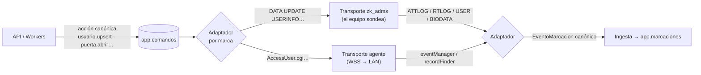
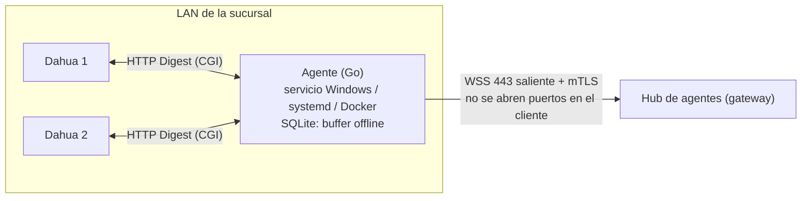

# 03 · Dispositivos: ZKTeco, Dahua y agentes locales

## 1. Principio: modelo canónico + adaptadores por marca

El resto del sistema (API, asistencia, reportes, permisos) **no sabe de marcas**. Habla de *acciones* y *eventos* canónicos. Cada marca tiene un adaptador que traduce en ambos sentidos, y cada adaptador se monta sobre un transporte.



```ts
// packages/dominio/src/dispositivos.ts
export type Accion =
  | { accion: 'usuario.upsert'; empleado_id: string }          // datos y secretos se leen AL ENVIAR
  | { accion: 'usuario.borrar'; pin: string }
  | { accion: 'usuarios.leer' }
  | { accion: 'marcaciones.recuperar'; desde: string; hasta: string }
  | { accion: 'hora.sincronizar' }
  | { accion: 'puerta.abrir'; puerta: number }
  | { accion: 'dispositivo.reiniciar' } | { accion: 'comando.crudo'; texto: string };

export interface EventoMarcacion {
  dispositivo_id: string; pin: string;
  hora_local: string;                // tal como la reporta el equipo
  tipo: 'marcacion' | 'acceso_concedido' | 'acceso_denegado';
  metodo?: 'rostro' | 'huella' | 'tarjeta' | 'clave' | 'qr' | 'remoto';
  sentido?: 0 | 1; puerta?: number; origen: 'tiempo_real' | 'recuperada';
}

// packages/adaptadores/src/tipos.ts
export interface Adaptador {
  marca: 'zkteco' | 'dahua';
  capacidades(info: InfoEquipo): Capacidades;
  renderizar(cmd: ComandoConDatos): { texto: string; redactado: string };  // redactado = sin Passwd/Card
  parsearEventos(tabla: string, cuerpo: string): EventoCanonico[];         // marcaciones, usuarios, biometría
  parsearResultados(cuerpo: string): ResultadoComando[];
}
```

Ventaja concreta: agregar Dahua (u otra marca) = un adaptador + a lo sumo un transporte. Empleados, asistencia, permisos, reportes y la UI no cambian.

## 2. Transportes

| Transporte | Quién inicia | Marcas / casos | Estado |
|---|---|---|---|
| `zk_adms` | El equipo sondea al gateway por HTTP(S) | ZKTeco con ADMS/PUSH (SenseFace 2A y similares) | Funciona hoy |
| `agente` | El agente local (LAN) mantiene un WSS saliente con la nube | Dahua por HTTP/CGI; ZKTeco sin ADMS (SDK TCP 4370, futuro) | Por implementar. **Opción por defecto para Dahua.** |
| `dahua_http` | El equipo Dahua sube eventos a una URL de plataforma | Solo modelos/firmwares que lo soporten | Evaluar por modelo |

## 3. ZKTeco ADMS: de lo que tienes a producción

Lo que ya funciona se conserva: las rutas `/iclock/*`, la cola de comandos, la bandeja de usuarios del reloj y la saga de cambio de PIN. Cambia lo siguiente.

### 3.1 Identidad del equipo (hoy: cualquiera que diga un SN)

ADMS no autentica al equipo: su identidad es el número de serie que viaja en la URL. Hoy [server.js:239-255](../../server.js#L239-L255) crea o acepta cualquier SN, y [server.js:475-490](../../server.js#L475-L490) entrega los comandos pendientes a quien presente ese SN. Esos comandos llevan PIN, nombre, tarjeta y clave, y en el cambio de PIN también las plantillas. Cualquiera que conozca o adivine un SN puede **llevarse esos datos** e **inyectar marcaciones falsas**.

Defensa en capas (ninguna es perfecta sola; juntas suben mucho el costo):

1. **Subdominio por empresa.** Cada tenant tiene `slug_equipos` (aleatorio). El instalador configura el equipo con `k3f9…eq.tudominio.com`. El gateway exige que el par **(host, SN)** coincida. Un SN conocido no basta si no se conoce el slug, y el slug no es enumerable.
   *Requisito:* que el firmware acepte un nombre de dominio como servidor ("Enable Domain Name" en los ADMS actuales). Si un modelo solo acepta IP, se registra por SN desde la consola (lista blanca) y se ata a la IP pública observada.
2. **HTTPS** donde el firmware lo soporte (puerto 443). Donde no, el tráfico va en claro: por eso los comandos llevan lo mínimo y el punto 5 importa.
3. **Cuarentena real.** Un equipo desconocido **no recibe comandos**. Sus eventos se guardan 7 días en `eventos_cuarentena` y se reprocesan si se acepta. Si llegó por el subdominio de una empresa, aparece en "Equipos detectados" del cliente; si llegó por el host genérico, solo lo ve la plataforma.
4. **Detección de anomalías.** Mismo SN desde dos IPs en la misma ventana, cambio brusco de IP + firmware, marcaciones con hora futura, ráfagas anormales. Resultado: alerta y bloqueo automático del SN hasta revisión.
5. **Comandos sin secretos en reposo.** `app.comandos.parametros` guarda referencias (`empleado_id`). La tarjeta y la clave se descifran y se renderizan **al momento de entregar**, y en `comando_vendor` queda la versión redactada (`Passwd=***`).
6. **Rate limit** por SN y por IP, y cuerpo máximo por tabla. Hoy son 20 MB para todo `/iclock`: basta con 1 MB para ATTLOG; los lotes grandes solo en tablas de foto, si algún día se habilitan.
7. **Sitios críticos:** equipo → agente local en la LAN → nube por mTLS. El protocolo en claro nunca sale del edificio.

### 3.2 Alta de un equipo

```mermaid
sequenceDiagram
  participant I as Instalador
  participant E as Reloj ZKTeco
  participant G as Gateway
  participant C as Panel cliente
  I->>C: "Agregar equipo" → muestra servidor k3f9….eq.tudominio.com
  I->>E: Configura servidor (dominio + puerto)
  E->>G: GET /iclock/cdata?SN=… (Host: k3f9….eq…)
  G->>G: host → tenant; SN nuevo → cuarentena de ESA empresa
  G-->>E: opciones ADMS (sin comandos)
  C->>C: "Equipos detectados: SN… [Aceptar]"
  C->>G: aceptar_dispositivo(sucursal, nombre)  ← valida permiso y cuota del plan
  G-->>E: desde ahora recibe comandos (leer usuarios, poner en hora…)
```

### 3.3 Comandos y sagas

- **TTL por acción** (`acciones_dispositivo.ttl`). `puerta.abrir` caduca a los 15 s: una puerta no debe abrirse sola media hora después porque el equipo se reconectó. `usuario.upsert` espera sin límite.
- **Reintentos**: como hoy (enviado sin respuesta > 2 min, máx. 3), pero lo hace un worker y no el propio sondeo.
- **Sagas genéricas.** Tu mecanismo `grupo` + `espera` del cambio de PIN se generaliza como `operacion_id` + `paso`: cada paso se libera solo si el anterior confirmó, y si algo falla se compensa. Sirve igual para "reemplazar equipo", "mover empleado de sucursal" o "revocar acceso en todas las puertas".
- **Menos cambios de PIN.** Se separa el `codigo` de RRHH (visible, puede cambiar) del `pin_dispositivo` (ID estable en los equipos). La mayoría de los "cambios de PIN" de hoy pasan a ser cambios de código, que no tocan los relojes. La saga queda para el caso real.
- **Hora y zona.** El equipo reporta hora local sin zona. Se convierte con la zona IANA de la **sucursal** (`America/La_Paz`), no con un offset fijo (`TIMEZONE: -4` en `config.js`), y se guarda `ocurrido_en timestamptz` + `hora_local`. Si la hora del equipo se aleja más de 2 min de la del servidor, salta una alerta y se encola `hora.sincronizar`. Las fechas fuera de rango (año 2000, futuro) van a una bandeja de rechazadas y no a la tabla.

### 3.4 Opciones ADMS

`Delay`, `TransFlag`, `TransTimes`, `Realtime` y compañía son **configuración de plataforma** (acción `dispositivo.configurar`, solo staff). Se guardan por modelo o firmware en un perfil, no fijas en el código como hoy en `optionsText()`.

## 4. Biometría: "cada equipo enrola" (decisión tomada)

- **No se almacenan plantillas ni fotos faciales en la nube.** Solo indicadores por equipo: `tiene_rostro` y `huellas`.
- Hoy la tabla `plantillas` ([server.js:56-59](../../server.js#L56-L59), [server.js:312-319](../../server.js#L312-L319)) guarda **para siempre** cada huella y rostro que el reloj reporta. Contradice la decisión: hay que **purgarla** y cambiar el flujo.
- **Cambio de PIN sin re-enrolar** (el único caso en que la plantilla pasa por el servidor): las plantillas viajan en una tabla **temporal y cifrada** con TTL de 15 min, se borran al confirmar la saga o al cancelarla, y un job barre lo vencido. Nunca se exportan ni se muestran.
- **Consecuencia aceptada:** si un equipo se daña, hay que re-enrolar. Para aliviarlo, un **asistente de reemplazo** envía usuarios, tarjetas y claves al equipo nuevo y genera la lista de quién debe volver a registrar rostro o huella.
- **Legal:** la biometría es dato sensible en la mayoría de las legislaciones (RGPD art. 9, LGPD de Brasil, leyes de LatAm). Incluye consentimiento y política de privacidad en el contrato y el onboarding, y **valídalo con un abogado local**. No almacenar plantillas es tu mejor argumento.

## 5. Dahua

**Modelos objetivo:** terminales de control de acceso y reconocimiento facial (p. ej. series ASI). **Confirma cada ruta contra el documento "HTTP API" de Dahua que corresponda al firmware de los modelos que vendas**, porque cambian entre versiones.

**Vía agente (por defecto).** El agente usa la API HTTP/CGI del equipo con autenticación Digest:

| Necesidad | Endpoint típico |
|---|---|
| Eventos en tiempo real | `eventManager.cgi?action=attach&codes=[AccessControl]` (conexión larga, multipart) |
| Recuperar registros | `recordFinder.cgi?action=find&name=AccessControlCardRec&StartTime=…&EndTime=…` |
| Usuarios, tarjetas y rostros | `AccessUser.cgi` / `AccessCard.cgi` / `AccessFace.cgi` (`insertMulti`, `updateMulti`, `removeMulti`) en firmwares recientes; `recordUpdater.cgi?action=insert&name=AccessControlCard` en antiguos |
| Abrir puerta | `accessControl.cgi?action=openDoor&channel=1` |
| Poner en hora | `global.cgi?action=setCurrentTime&time=…` |

**Traducción al modelo canónico:** evento de `AccessControl` → `acceso_concedido` o `acceso_denegado` según el resultado; `Method` → `metodo`; `UserID` → `pin`; `Door` → `puerta`. Un equipo con `uso = 'asistencia'` genera `tipo = 'marcacion'`.

**Rostro en Dahua:** el enrolamiento se hace **en el equipo**, coherente con la decisión. La API de rostros por foto existe, pero no se usa porque implicaría manejar fotos faciales en la nube.

**Vía directa (`dahua_http`):** algunos modelos pueden subir eventos por HTTP a una plataforma de terceros. Si los tuyos lo soportan, aplican las mismas reglas de identidad (host por empresa, cuarentena, anomalías) y no hace falta agente para recibir eventos. Para *enviar* usuarios todavía se necesita alcanzar el equipo, así que el agente sigue siendo lo más completo.

## 6. Agente local (edge)



| Aspecto | Diseño |
|---|---|
| Instalación | Instalador MSI o servicio de Windows, paquete Linux o imagen Docker. Se configura con un **token de un solo uso** (15 min) generado en el panel. |
| Enrolamiento | El agente genera su llave y envía un CSR con el token. La nube firma un **certificado de cliente** atado a `tenant_id` + `sucursal_id` (`agentes.huella_cert`). Rotación cada 90 días; revocación inmediata desde el panel. |
| Conexión | WSS saliente por 443 con mTLS y latido cada 30 s. Los comandos llegan por *push*, sin sondeo. Mensajes JSON: `comando`, `resultado`, `evento`, `estado`. |
| Offline | Eventos en SQLite con clave de idempotencia; al reconectar reenvía en orden. La nube deduplica por `(dispositivo, pin, ocurrido_en)`. |
| Credenciales de los equipos | La clave admin de cada Dahua se guarda **solo en el agente**, cifrada (DPAPI en Windows, keyring en Linux). La nube nunca la conoce. |
| Actualización | Binarios firmados (ed25519) con verificación antes de reemplazar. Despliegue por anillos (5 % → 25 % → 100 %) con vuelta atrás automática si deja de reportar. |
| Autoridad | El agente solo ejecuta acciones del catálogo canónico para equipos de **su** sucursal. Un agente comprometido no puede tocar otra empresa. |
| Salud | Versión, equipos alcanzables, tamaño del buffer y deriva de hora. Se ve en la consola, y un resumen en el panel del cliente. |

## 7. Estado y salud de equipos

| Señal | Fuente | Acción |
|---|---|---|
| En línea / fuera de línea | Presencia en Redis (TTL 120 s) | Evento Realtime al panel. Alerta al cliente tras N min (configurable por plan). |
| Cola atascada | Comandos `enviado` sin respuesta, por equipo | Reintento → error legible → alerta de plataforma |
| Deriva de hora | Hora del evento en tiempo real vs. recepción | Alerta y `hora.sincronizar` automático |
| Sin marcaciones en horario laboral | Worker de asistencia | Aviso: "El reloj de Sucursal Norte no registra marcaciones desde las 08:00" |
| Firmware | `info_tecnica` | Solo plataforma: inventario por versión, planificación de actualizaciones |
