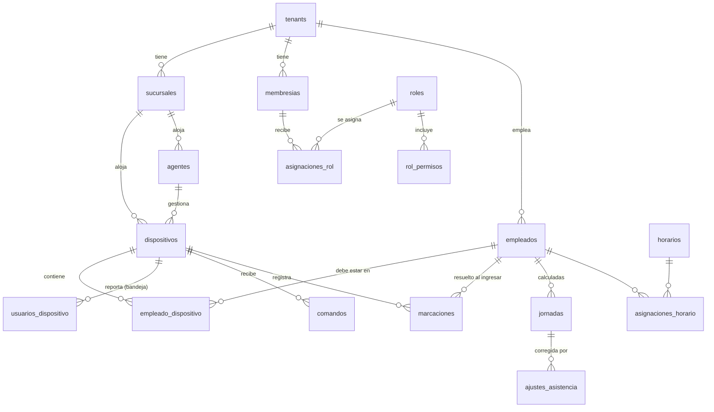

# 04 · Datos, marcaciones, asistencia, control de acceso y reportes

## 1. Convenciones (valen para todas las tablas)

| Regla | Motivo |
|---|---|
| Todo en el esquema `app`; nada en `public` | `public` lo expone PostgREST y tiene privilegios por defecto para `anon`/`authenticated` |
| `tenant_id` en **todas** las tablas de cliente, incluidas las hijas | RLS simple y rápida (sin JOIN), particionado e índices por empresa |
| FKs compuestas `(tenant_id, id)` | La BD rechaza cruces entre empresas aunque la API falle (probado) |
| UUID para entidades, generados en la app como **UUIDv7** | No enumerables (hoy son `SERIAL`: `/api/empleados/1`, `/2`…) y ordenados en el tiempo, amables con los índices. El `default gen_random_uuid()` queda como respaldo. |
| `bigint identity` para tablas de volumen (marcaciones, auditoría, comandos) | Compactas; nunca se exponen como identificador público de una entidad |
| `timestamptz` siempre; `timestamp` solo para "hora tal como la dijo el equipo" | Hoy `marcaciones.fecha` es `TIMESTAMP` sin zona |
| Sin `ON DELETE CASCADE` desde `tenants` | Hoy `DELETE /api/empresas/:id` borra todo al instante. Se reemplaza por baja programada (`eliminar_desde`) con exportación previa y purga por job. |
| Los equipos no se borran: `estado = 'retirado'` | Sus marcaciones siguen siendo válidas. Hoy quedan huérfanas y dejan de verse ([server.js:66](../../server.js#L66) + [server.js:944](../../server.js#L944)). |
| Migraciones SQL versionadas (`supabase/migrations`) | Hoy el esquema se crea con `CREATE … IF NOT EXISTS` y `ALTER … IF NOT EXISTS` al arrancar |

## 2. Mapa del modelo



El SQL del núcleo, de dispositivos, empleados, comandos, marcaciones y auditoría está en [sql/](sql/). Asistencia y acceso se esbozan abajo: se implementan en la fase 2 y la fase 3.

## 3. Marcaciones a escala

```sql
create table app.marcaciones (
  id bigint generated always as identity, tenant_id uuid not null, sucursal_id uuid not null,
  dispositivo_id uuid not null, empleado_id uuid, pin text not null,
  ocurrido_en timestamptz not null, hora_local timestamp not null,
  tipo text not null, sentido smallint, metodo text, puerta smallint, origen text not null,
  recibido_en timestamptz not null default now(),
  primary key (ocurrido_en, id),
  unique (dispositivo_id, pin, ocurrido_en)            -- idempotencia
) partition by range (ocurrido_en);                     -- una partición por mes
```

- **Particionado mensual.** Las consultas por rango de fechas tocan 1 o 2 particiones. Borrar un año viejo es un `DROP` instantáneo, no un `DELETE` de millones de filas. Las particiones se crean por adelantado con `pg_cron`: `app.crear_particiones()`.
- **Índices** `(tenant_id, ocurrido_en)`, `(tenant_id, empleado_id, ocurrido_en)`, `(tenant_id, sucursal_id, ocurrido_en)`. Verificado con `EXPLAIN`: RLS se traduce en una condición de índice, no en un filtro por fila.
- **El empleado se resuelve al ingresar** (`empleado_id`). Hoy se resuelve en cada consulta con un `LATERAL` por fila, incluyendo `pines_anteriores` ([server.js:941-943](../../server.js#L941-L943)), lo que no escala. Para reimportar logs viejos se guarda el historial `empleado_pines(empleado_id, pin, desde, hasta)`.
- **`sucursal_id` denormalizado**: el alcance por sucursal del supervisor se filtra sin JOIN.
- **Inmutables.** Nadie las edita ni las borra. Una marcación olvidada o errónea se corrige con un **ajuste** aprobado (tabla aparte, auditada). El reporte muestra "cruda + ajuste".
- **Retención por plan.** Un job mensual exporta a **Parquet** en almacenamiento S3 las particiones que salen de `retencion_meses` (archivo frío, recuperable a pedido) y luego hace `DETACH` + `DROP`.

## 4. Asistencia

```sql
create table app.horarios (            -- plantilla de turno
  id uuid primary key, tenant_id uuid not null, nombre text not null,
  entrada time not null, salida time not null, cruza_medianoche boolean not null default false,
  tolerancia_entrada_min int not null default 5, tolerancia_salida_min int not null default 0,
  descanso_min int not null default 0, dias smallint[] not null            -- 1=lunes … 7=domingo
);
create table app.asignaciones_horario (  -- quién sigue qué horario y desde cuándo
  tenant_id uuid not null, empleado_id uuid not null, horario_id uuid not null,
  vigente_desde date not null, vigente_hasta date
);
create table app.feriados  (tenant_id uuid, fecha date, nombre text, sucursal_id uuid);        -- null = todas
create table app.ausencias (tenant_id uuid, empleado_id uuid, desde date, hasta date, tipo text, aprobado_por uuid);
create table app.jornadas (            -- RESULTADO calculado, uno por empleado y día
  tenant_id uuid not null, empleado_id uuid not null, fecha date not null,
  primera_entrada timestamptz, ultima_salida timestamptz,
  minutos_trabajados int, atraso_min int, salida_anticipada_min int, extra_min int,
  estado text not null,   -- completa | incompleta | falta | feriado | ausencia | descanso
  calculada_en timestamptz not null,
  primary key (tenant_id, empleado_id, fecha)
);
create table app.ajustes_asistencia (  -- nunca se edita una marcación: se ajusta
  id uuid primary key, tenant_id uuid not null, empleado_id uuid not null, fecha date not null,
  tipo text not null,     -- marcacion_olvidada | anular_marcacion | permiso | justificacion
  hora timestamptz, motivo text not null,
  estado text not null default 'pendiente', solicitado_por uuid, aprobado_por uuid
);
```

**Cálculo:**

- Es **incremental e idempotente**. Cada marcación nueva encola `recalcular(empleado, fecha_laboral)`, deduplicado en BullMQ, con 60 s de espera para agrupar ráfagas. Cambiar un horario, un feriado o un ajuste encola el rango afectado.
- **Fecha laboral ≠ fecha calendario.** Un turno 22:00–06:00 pertenece al día en que empieza (`cruza_medianoche`). La marcación de las 05:58 se asigna a la jornada del día anterior.
- **Emparejamiento.** Si el equipo informa el sentido (entrada/salida), se usa. Si no, se alternan los eventos del día laboral y se descartan duplicados en menos de N minutos (doble toque).
- Los reportes leen de `jornadas`, **nunca** recalculan desde las marcaciones crudas en línea. Cerrar un período (quincena o mes) marca las jornadas como cerradas: después solo cambian con un ajuste aprobado.

## 5. Control de acceso (fase 3)

```sql
create table app.puertas         (id uuid, tenant_id uuid, dispositivo_id uuid, numero smallint, nombre text);
create table app.grupos_acceso   (id uuid, tenant_id uuid, nombre text);
create table app.horarios_acceso (id uuid, tenant_id uuid, nombre text, franjas jsonb);  -- [{dias:[1..5], desde:'07:00', hasta:'19:00'}]
create table app.reglas_acceso   (tenant_id uuid, grupo_id uuid, puerta_id uuid, horario_acceso_id uuid);
create table app.miembros_grupo  (tenant_id uuid, grupo_id uuid, empleado_id uuid, vigente_hasta timestamptz);
```

Las reglas se **compilan** a acciones canónicas por equipo. En ZKTeco serían zonas horarias y grupos de acceso; en Dahua, planes de tiempo y permisos de puerta por usuario. Se envían como comandos. La decisión de abrir la toma **el equipo, offline**. La nube define las reglas y recibe los eventos, pero nunca está en el camino crítico de la puerta. Los visitantes temporales son miembros con `vigente_hasta`, y un job los revoca al vencer.

## 6. Reportes

| Tipo | Cómo |
|---|---|
| En pantalla (paginado) | Consulta con cursor (keyset sobre `(ocurrido_en, id)`), nunca `OFFSET` |
| Exportación (CSV/XLSX) | **Job asíncrono**: el worker genera el archivo en streaming (sin cargar todo en memoria) y lo sube a Supabase Storage en `reportes/{tenant_id}/…`, en un bucket privado. El panel recibe una URL firmada que vence en 5 min. Hoy el límite es de 20.000 filas en memoria. |
| Programados (plan avanzado) | Cron por empresa (p. ej. "cada lunes, asistencia de la semana a RRHH") |
| Pesados o consolidados | Primero contra una **réplica de lectura**. En la etapa 4, contra una base analítica. |

El exportador XLSX sin dependencias que ya tienes sirve para archivos chicos. Para archivos grandes conviene una librería con escritura en streaming.

## 7. Tiempo real

- Canales privados **Broadcast** de Supabase Realtime: `tenant:{id}:dispositivos` (en línea, sincronización) y `tenant:{id}:sucursal:{id}:eventos` (marcaciones y accesos en vivo, para recepción).
- **Los emite el backend** (gateway o worker) con `realtime.send(payload, evento, topico, true)` o con la API HTTP de Realtime, agrupados cada ~1 s para no saturar.
- **Autorización** con RLS sobre `realtime.messages`:

```sql
create policy "escucha su empresa" on realtime.messages for select to authenticated using (
  split_part(realtime.topic(), ':', 1) = 'tenant'
  and split_part(realtime.topic(), ':', 2)::uuid = (select app.tenant_actual())
  and (   split_part(realtime.topic(), ':', 3) <> 'sucursal'
       or (select app.permiso_global('marcaciones.ver'))
       or split_part(realtime.topic(), ':', 4)::uuid = any ((select app.sucursales_con_permiso('marcaciones.ver'))::uuid[])));
```
