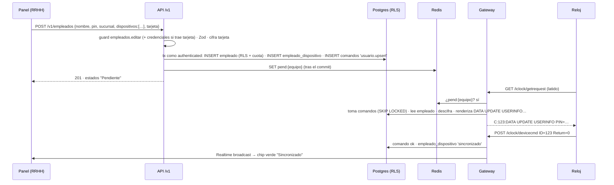

# 06 · API y frontend

## 1. Superficies de API

| Superficie | Host | Consumidores | Autenticación | Rol de BD |
|---|---|---|---|---|
| **Cliente** `/v1` | `api.tudominio.com` | Panel del cliente, integraciones del cliente | JWT de Supabase **o** API key | `authenticated` |
| **Plataforma** `/platform/v1` | `consola-api.tudominio.com` (allowlist) | Consola (tú, soporte, finanzas) | JWT de staff con `aal2` | `consola` |
| **Equipos** `/iclock/*`, `/dahua/*`, `wss://agentes…` | `*.eq.tudominio.com`, `agentes.tudominio.com` | Relojes y agentes | Host + SN + anomalías; mTLS para agentes | `gateway` |

Son despliegues separados que comparten los paquetes `dominio`, `db` y `authz`. Un fallo o una sobrecarga en la ingesta de equipos no tumba el panel.

## 2. Convenciones

- **REST + JSON**, versión en la ruta (`/v1`). Solo cambios compatibles dentro de una versión.
- **Contrato**: esquemas Zod → OpenAPI 3.1 publicado en `/v1/openapi.json` para los clientes con plan de integraciones.
- **Errores** `application/problem+json`: `{ type, title, status, detail, codigo, request_id }`. Códigos de negocio estables: `plan_limite`, `modulo_no_incluido`, `mfa_requerido`, `equipo_fuera_de_linea`.
- **Paginación por cursor**: `?limite=100&cursor=…`, con `siguiente` en la respuesta.
- **Idempotencia**: el header `Idempotency-Key` en los POST se guarda 24 h por empresa.
- **Filtros de fecha** en la zona de la sucursal (o `?tz=`). Las respuestas en ISO 8601 con offset.
- **Rate limit** con headers `RateLimit-*`. Límite de la API por plan (`api_llamadas_dia`).

## 3. API keys para integraciones (planilla, ERP)

- Formato `sf_live_<prefijo8>_<secreto32>`. Se guarda solo el hash (SHA-256 con pepper) y el prefijo, para identificarla en logs.
- Cada llave es como una **membresía de máquina**: tiene un rol (por lo general solo lectura, p. ej. `marcaciones.ver` + `asistencia.ver`), alcance por sucursal opcional, vencimiento y lista de IP permitidas.
- La API la traduce a claims (`{ sub: api_key_id, tenant_id, tipo: 'api_key' }`) y usa el mismo `comoUsuario()`. RLS aplica igual.
- Crear y revocar llaves exige `integraciones.api_keys` (sensible: MFA). Cada uso queda registrado (`ultimo_uso`).

## 4. Webhooks

- Eventos: `marcacion.creada`, `jornada.cerrada`, `dispositivo.fuera_de_linea`, `dispositivo.en_linea`, `empleado.sincronizado`, `acceso.denegado`.
- Firma `X-SenseFace-Signature: t=…,v1=HMAC_SHA256(secreto, t + "." + cuerpo)`. Ventana de 5 min contra reenvíos.
- Entrega por worker, reintentos exponenciales durante 24 h, desactivación automática tras fallos continuos, y registro de entregas visible al cliente.
- Las URLs destino se validan contra SSRF: nada de IP privadas, `localhost` ni metadatos de la nube.

## 5. Endpoints principales

**Cliente (`/v1`)**

| Recurso | Endpoints | Permiso |
|---|---|---|
| Sesión | `GET /me` (usuario, empresa, plan, módulos, uso vs. límites, `permisos: {permiso: 'global' \| [sucursales]}`) · `POST /sesion/empresa` | autenticado |
| Sucursales | `GET/POST /sucursales` · `PATCH/DELETE /sucursales/:id` | `sucursales.*` |
| Equipos | `GET /dispositivos` · `GET /dispositivos/detectados` · `POST /dispositivos/:id/aceptar` · `PATCH /dispositivos/:id` · `POST /dispositivos/:id/acciones` (`{accion: 'usuarios.leer' \| 'hora.sincronizar' \| …}`) · `GET /dispositivos/:id/comandos` · `GET /dispositivos/:id/bandeja` · `POST /dispositivos/:id/bandeja/importar` | `dispositivos.*` |
| Agentes | `POST /agentes/token-enrolamiento` · `GET /agentes` · `DELETE /agentes/:id` | `dispositivos.administrar` |
| Empleados | `GET/POST /empleados` · `PATCH/DELETE /empleados/:id` · `PUT /empleados/:id/dispositivos` · `PUT /empleados/:id/credenciales` · `POST /empleados/importar` | `empleados.*` |
| Marcaciones | `GET /marcaciones` · `POST /exportaciones` (asíncrona) · `GET /exportaciones/:id` | `marcaciones.*` |
| Asistencia | `/horarios`, `/asignaciones-horario`, `/feriados`, `/jornadas`, `/ajustes` (+ `/aprobar`) | `asistencia.*` |
| Acceso | `/puertas`, `/grupos-acceso`, `/horarios-acceso`, `POST /puertas/:id/abrir` | `acceso.*` |
| Usuarios y roles | `/usuarios` (invitar, suspender), `/usuarios/:id/roles`, `/roles`, `GET /permisos` (catálogo filtrado por plan) | `usuarios.*`, `roles.administrar` |
| Auditoría | `GET /auditoria`, `GET /sesiones-soporte` | `auditoria.ver` |
| Integraciones | `/api-keys`, `/webhooks`, `/webhooks/:id/entregas` | `integraciones.*` |

**Plataforma (`/platform/v1`)**: `/tenants` (alta, estado, plan), `/tenants/:id/excepciones`, `/tenants/:id/uso`, `/planes`, `/dispositivos` (con técnica: IP, firmware, cola), `/dispositivos/cuarentena`, `/dispositivos/:id/asignar`, `/dispositivos/:id/acciones` (solo acciones de plataforma), `/dispositivos/:id/log` (tráfico de protocolo, retención 7 días), `/agentes` (versiones, rollout), `/soporte/sesiones` (abrir, revocar), `/salud` (colas, lag, equipos en línea), `/auditoria`, `/staff`.

## 6. Un flujo de punta a punta: crear un empleado

## 7. Frontend

**Dos aplicaciones** en el monorepo, con componentes compartidos (`packages/ui`):

| | Panel del cliente (`app.`) | Consola (`consola.`) |
|---|---|---|
| Menú | Inicio · Sucursales · Equipos · Empleados · Marcaciones · Asistencia · Control de acceso · Reportes · Usuarios y roles · Auditoría · Integraciones · Mi plan | Empresas · Planes · Equipos (cuarentena, técnica, logs) · Agentes · Soporte · Salud · Auditoría · Staff |
| Visibilidad | Se arma desde `GET /v1/me`. Un módulo fuera del plan se muestra bloqueado con "Disponible en Profesional". Si falta el permiso, el elemento no aparece. | Todo lo técnico. Los datos de empleados solo dentro de una sesión de soporte, con banner permanente. |
| Tiempo real | Estado de equipos, sincronización, marcaciones en vivo (recepción) | Salud global |

**Pautas:**
- **La UI nunca decide la seguridad**: oculta y guía, pero la API y RLS bloquean igual.
- Stack: React + Vite + TypeScript, TanStack Router y Query (caché e invalidación por Realtime), shadcn/ui + Tailwind, React Hook Form + Zod (**los mismos esquemas que la API**).
- `supabase-js` solo para login/MFA y Realtime. Los datos van siempre por la API.
- Los estados de equipo y de sincronización usan el vocabulario que ya tienes (Pendiente / Sincronizado / Error), con el motivo legible del error, nunca el código del protocolo.
- Accesibilidad y uso en móvil: supervisores y recepción lo usarán en el teléfono.
- i18n desde el inicio (es-BO por defecto), fechas en la zona de la sucursal.
